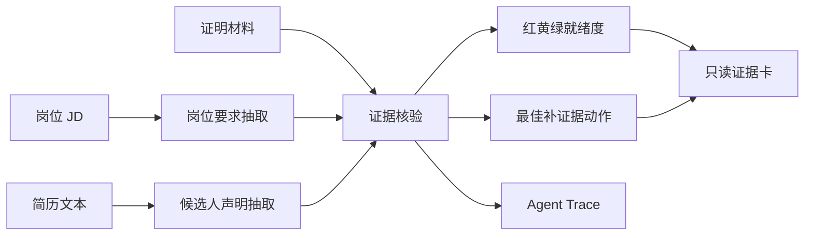

# Clack

Clack 是一个投递前证据体检台：粘贴岗位 JD、导入简历和证明材料，先判断“这份简历里的声明有没有证据支撑”，再决定是否投递。

它不是简历润色器，也不替企业做录用判断。Clack 只输出岗位要求、候选人声明、证据缺口、最佳补证据动作和可分享的只读证据卡。

## 核心能力

- 岗位导入：支持粘贴 JD，也支持抓取公开岗位链接并抽取正文。
- 简历导入：支持粘贴文本、上传 TXT 和文字型 PDF。
- 证据体检：生成红黄绿就绪度、3 个关键证据缺口和 1 个最该补的动作。
- 证据复核：补充材料后刷新报告，展示分数变化和状态变化。
- AI 助手动作：把证据弱的声明改写成 STAR 简历句，预演面试追问，多岗位对比先投哪个。
- 只读分享：生成候选人可分享的证据卡，企业端只看授权范围内的材料。
- 过程审计：保留 Agent Trace，展示 JD 解析、简历声明、证据核验和建议生成过程。
- 多角色空间：候选人、企业、高校和管理员视角使用同一套证据数据。

## 技术栈

- Next.js 16 App Router
- React 19
- TypeScript
- Framer Motion / GSAP
- lucide-react
- PDF.js
- OpenAI-compatible SDK
- Cloudflare Workers / OpenNext / D1
- Playwright

## 本地运行

```bash
npm install
npm run dev -- --port 4387
```

打开 `http://localhost:4387`。

常用命令：

```bash
npm run typecheck
npm run build
npm run test:e2e
```

Cloudflare 构建和部署：

```bash
npm run cf:build
npm run cf:preview
npm run deploy
```

## 环境变量

岗位证据分析由真实 LLM 驱动；没有密钥时单步会自动降级到规则路径，演示样例仍可跑通。

```bash
OPENAI_API_KEY=
OPENAI_BASE_URL=
OPENAI_DEFAULT_MODEL=
```

Cloudflare D1 绑定名为 `DB`，配置见 `wrangler.jsonc`。

## 工作流




## 项目结构

```text
src/app/                         Next.js App Router 页面和 API
src/components/home-client.tsx    候选人导入工作台
src/components/result-client.tsx  体检结果、补证据和复核
src/components/result-actions.tsx STAR 改写、面试追问、多岗位对比
src/components/card-client.tsx    只读证据卡
src/components/trace-client.tsx   Agent Trace
src/components/commercial-workspaces.tsx
                                 企业、高校、管理员和证据护照空间
src/lib/report-store.ts          D1 / 本地文件双路径持久化
src/lib/ai-provider.ts           OpenAI-compatible 客户端配置
src/lib/ai-pipeline.ts           6 智能体岗位证据分析流水线
src/lib/ai-actions.ts            简历改写、追问评估、岗位对比
src/lib/pipeline-meta.ts         智能体清单（前后端共用）
docs/ARCHITECTURE.md             架构、权限和 API 说明
docs/DEPLOYMENT.md               Cloudflare 部署说明
tests/                           Playwright 主流程测试
public/brand/                    品牌图形资源
public/vendor/pdf.worker.min.mjs PDF.js worker
```

## 边界

- 只判断声明和证据之间的可证明性。
- 不验证经历真假。
- 不做录用、淘汰或背调决定。
- 不读取未授权材料。
- 扫描版 PDF 和图片 OCR 属于后续增强方向。
