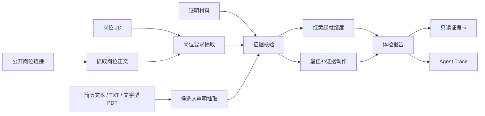

<div align="center">


# Clack

### 粘贴岗位 JD 和简历，30 秒拿到红黄绿就绪度、3 个证据缺口和 1 个补材料动作。

Clack 给准备投递的候选人生成一张可检查的求职证据报告。评委可以跑在线 demo，看系统如何把岗位要求、简历声明和证明材料对齐，再打开只读证据卡或 Agent Trace 检查每一步。

[在线演示](https://touqian-tijian.veithly.workers.dev) ·
[本地运行](#本地运行) ·
[检查结果](#运行后检查什么) ·
[架构说明](./docs/ARCHITECTURE.md) ·
[部署说明](./docs/DEPLOYMENT.md)

</div>

---

## 30 秒评审路径

1. 打开在线演示或本地 `http://localhost:4387`。
2. 在首页使用示例岗位、简历和证明材料，也可以粘贴自己的 JD 和简历文本。
3. 提交后进入扫描台，6 个智能体依次抽取岗位要求、简历声明、证据绑定和行动建议。
4. 初始样例会给出黄灯报告、42 分、3 个证据缺口和一个最该补的材料。
5. 在结果页补充项目复盘材料，报告刷新到绿灯、78 分，并生成更新后的只读证据卡。
6. 打开 Agent Trace，检查每个智能体的输入、输出和规则兜底结果。

## 运行后检查什么

| 用户动作 | 屏幕结果 | 检查位置 |
| --- | --- | --- |
| 粘贴岗位 JD、简历和证明材料 | 红黄绿就绪度、缺口列表、下一步补证据动作 | `/result/[id]` |
| 补充一段项目复盘材料 | 分数和状态刷新，证据卡版本更新 | `/result/[id]` 和 `/card/[id]` |
| 打开过程审计 | JD 解析、声明抽取、证据核验、建议生成逐步展开 | `/trace/[id]` |
| 使用候选人、企业、高校、管理员入口 | 同一份证据按角色显示不同权限边界 | `/candidate`、`/enterprise`、`/school`、`/admin` |
| 运行 Playwright 主流程 | 浏览器自动完成首页、导入、报告和角色入口检查 | `tests/hero-flow.spec.ts` 等 |

## 产品画面

<table>
  <tr>
    <td width="33%"></td>
    <td width="33%"></td>
    <td width="33%"></td>
  </tr>
  <tr>
    <td>候选人先看到缺口，不急着改简历。</td>
    <td>流水线把岗位、声明和材料拆成可复核步骤。</td>
    <td>报告给出下一次补材料的具体动作。</td>
  </tr>
</table>

## 工作机制



系统用模型做语义抽取和建议生成，用规则层控制分数、阈值和状态变化。没有模型密钥或单步超时，样例路径会回到规则结果，报告仍能跑完。

## 关键技术选择

| 决策 | 当前选择 | 原因 |
| --- | --- | --- |
| 前端与路由 | Next.js 16 App Router、React 19、TypeScript | 页面、API 和 Workers 部署共用一套工程 |
| 简历解析 | 浏览器端 PDF.js 解析文字型 PDF/TXT | 服务端只接收解析后的文本和文件名 |
| 智能体流水线 | 6 个岗位证据智能体 + 稳定规则层 | 模型负责理解文本，规则负责可复现的状态变更 |
| 模型响应 | 普通模型使用 JSON 模式，推理模型读取 `content` / `reasoning_content` / `reasoning` | 兼容会把 JSON 写进 reasoning 的模型返回 |
| 状态存储 | Cloudflare D1，开发环境回退到 `.data/reports.json` | 在线 demo 有持久报告，本地 `next dev` 也能跑 |
| 端到端检查 | Playwright | 覆盖首页、导入、报告、证据卡和角色入口 |

## 本地运行

```bash
npm install
npm run dev -- --port 4387
```

打开 `http://localhost:4387`，点击示例数据后提交。需要真实模型时添加服务端环境变量：

```bash
OPENAI_API_KEY=
OPENAI_BASE_URL=
OPENAI_DEFAULT_MODEL=
```

常用检查：

```bash
npm run typecheck
npm run build
npm run test:e2e
```

部署命令和 D1 绑定见 [docs/DEPLOYMENT.md](./docs/DEPLOYMENT.md)。D1 绑定名为 `DB`，配置在 `wrangler.jsonc`。

## 项目结构

```text
src/app/                         Next.js 页面和 API
src/components/home-client.tsx    候选人导入工作台
src/components/result-client.tsx  体检结果、补证据和复核
src/components/result-actions.tsx STAR 改写、面试追问、多岗位对比
src/components/card-client.tsx    只读证据卡
src/components/trace-client.tsx   Agent Trace
src/components/commercial-workspaces.tsx
                                  企业、高校、管理员和证据护照空间
src/lib/report-store.ts           D1 / 本地文件双路径持久化
src/lib/ai-provider.ts            模型客户端、JSON 解析和推理模型兼容
src/lib/ai-pipeline.ts            6 智能体岗位证据分析流水线
src/lib/ai-actions.ts             简历改写、追问评估、岗位对比
src/lib/pipeline-meta.ts          智能体清单
docs/ARCHITECTURE.md              架构、权限、API 和安全边界
docs/DEPLOYMENT.md                部署和运行时绑定
tests/                            Playwright 主流程测试
public/art/                       README 和产品页视觉资源
public/brand/                     品牌图形资源
public/vendor/pdf.worker.min.mjs  PDF.js worker
```

## 安全边界

- `OPENAI_API_KEY` 只在服务端使用，浏览器不读取模型密钥。
- 报告只保存用户输入文本、来源 URL、文件名和分析结果，不保存上传 PDF 原文件。
- 只读证据卡没有编辑入口，企业端只能查看候选人授权的材料。
- 系统判断声明和材料之间的可证明性，不验证经历真假。
- 企业端不自动排名、不自动淘汰候选人，也不替企业做录用决定。
- 扫描版 PDF 和图片 OCR 暂不处理；请粘贴文本或上传文字型 PDF/TXT。
