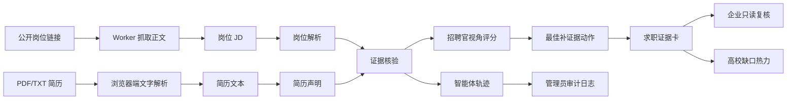

# 架构说明

咔哒的核心是“证据可证明性”判断和“招聘证据层权限”。系统不替用户美化经历，也不验证经历真假，只把岗位要求、简历声明和证明材料对齐到同一份报告里，再按候选人、企业、高校和管理员四类角色展示不同页面。

## 数据流

## 角色权限

| 角色 | 可以看到 | 不可以做 |
| --- | --- | --- |
| 候选人 | 岗位体检、证据护照、授权证据卡 | 查看其他候选人、代替企业复核、修改审计日志 |
| 企业复核员 | 候选人授权证据、人工复核面板、补证据请求 | 查看私密材料、按敏感属性排序、让 AI 自动淘汰 |
| 高校导师 | 学生准备度、岗位缺口热力、院系训练包 | 查看企业复核备注、查看学生私密材料原文、给学生能力打分 |
| 平台管理员 | 角色权限模板、敏感字段过滤、AI/D1 状态、审计日志 | 编辑候选人材料、替企业作录用决定、绕过用户授权 |

## 存储模型

D1 表名：`reports`

| 字段 | 用途 |
| --- | --- |
| `id` | 报告 ID |
| `sessionId` | 游客会话 |
| `ownerId` | 报告归属 |
| `shareToken` | 只读分享边界 |
| `role` | `candidate` 或 `readonly` |
| `report_json` | 完整体检报告、证据卡和智能体轨迹 |
| `createdAt` / `updatedAt` | 创建和更新时间 |

本地开发优先读取 OpenNext 提供的 D1 绑定；如果没有绑定，则写入 `.data/reports.json`，保证普通 `next dev` 也能跑通。

## API

| 路由 | 方法 | 作用 |
| --- | --- | --- |
| `/api/report` | `GET` | 返回演示岗位、简历和证明材料 |
| `/api/import/jd` | `POST` | 抓取公开岗位页面正文并填入 JD |
| `/api/report` | `POST` | 创建体检报告 |
| `/api/report/stream` | `POST` | 以 NDJSON 流式返回 6 智能体执行进度并创建报告 |
| `/api/report/[id]` | `GET` | 读取报告 |
| `/api/report/[id]/evidence` | `POST` | 写入证明材料并刷新报告 |
| `/api/report/[id]/rewrite` | `POST` | 将证据弱的声明改写成 STAR 简历句 |
| `/api/report/[id]/interview` | `POST` | 评估候选人对招聘官追问的回答 |
| `/api/report/[id]/compare` | `POST` | 对比多个岗位的证据就绪度 |
| `/api/card/[id]` | `GET` | 读取求职证据卡 |
| `/api/trace/[id]` | `GET` | 读取智能体轨迹 |

多用户演示工作台：

| 路由 | 角色 | 页面 |
| --- | --- | --- |
| `/` | 全部 | 电影式首页和角色入口 |
| `/login` | 全部 | 演示账号登录和角色选择 |
| `/candidate` | 候选人 | 体检工作台和材料导入 |
| `/passport` | 候选人 | 证据护照 |
| `/enterprise` | 企业复核员 | 授权证据队列和人工复核 |
| `/school` | 高校导师 | 准备度、缺口热力和训练包 |
| `/admin` | 平台管理员 | 权限、敏感字段和审计控制台 |

## 评分规则

P0 使用 6 智能体流水线 + 稳定规则层：

- 初始样例：42 分，黄灯，3 个证据缺口。
- 补充项目复盘证据后：78 分，绿灯，证据卡版本更新。
- OpenAI-compatible 模型负责抽取岗位要求、简历声明、证据绑定、招聘官追问和行动建议；分数、阈值、状态变更由规则层控制，保证演示可复现。
- PDF.js 在浏览器端解析文字型 PDF/TXT 简历，填入简历文本框；服务端只保存解析后的文本和文件名。
- `/api/import/jd` 在 Worker 端抓取公开岗位链接，去除脚本和样式后提取正文；需要登录或反爬页面会明确提示手动粘贴。
- `/api/report/stream` 让前端扫描台逐个点亮智能体；没有模型密钥或单步失败时，系统自动降级到规则兜底。
- 结果页提供 STAR 改写、面试追问预演和多岗位对比三个 AI 动作。
- 多角色 Demo 使用同一份证据依次展示候选人、企业、高校和管理员视角；视频路径为 `pitch/recording/multi-role-demo.mp4`。
- 多角色 Pitch Deck 路径为 `pitch/deck/咔哒-多用户权限版路演.pptx`，预览 contact sheet 在 `outputs/manual-20260608/presentations/clack-multi-role/preview/contact-sheet.png`。

## 安全边界

- `OPENAI_API_KEY` 只在服务端使用。
- 浏览器只拿到报告结果，不直接读取模型密钥。
- 只读证据卡不提供编辑入口。
- 当前版本只保存用户输入文本、来源 URL 和文件名，不保存上传 PDF 原文件。
- 只支持文字型 PDF；扫描版图片简历不做 OCR。
- 系统不验证经历真实性，也不自动投递。
- 企业端不自动排名、不自动淘汰候选人，只输出人工复核前的证据状态。
- 敏感字段不参与判断；管理员只看过滤和审计状态，不编辑候选人私密材料。
